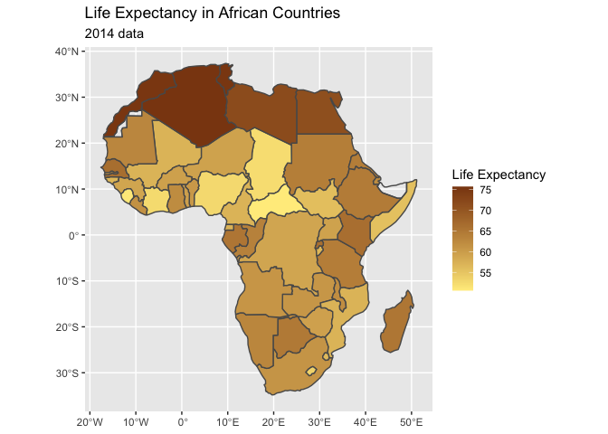

Life Expectancy in Africa (a Map)
================

## Introduction

Welcome welcome! Are you tired of always seeing the US map plotted? Say
no more and take a look at how Africa is being plotted using ggplot. We
will also plot the life expectancy by country.

Before we plot the map, we need to load the necessary coordinates for
African countries. Today we will use a new package called spData that
has data on world coordinates and other parameters such as population
and life expectancy. We will filter this data set for African countries
to later on plot the shape of Africa and the life expectancy.

Let’s get into it!

## Code for the Data Set Wrangling

1.  Load the following packages: tidyverse, sf, and spData.
2.  Filter the data set “world” for African countries.

``` r
#Load necessary packages
library(tidyverse)
library(sf)
library(spData)

#The data set is world. Filter world by "Africa" continent
africa_map = world %>% 
  filter(continent == "Africa")
```

## Code for the Map Plotting

Now that we have the dataset ready, it’s time to plot it with ggplot!

``` r
legend_title = "Life Expectancy"

ggplot() +
  geom_sf(data=africa_map,aes(fill=lifeExp))+
  scale_fill_gradient(legend_title, low = "lightgoldenrod1", high = "saddlebrown", na.value = NA) +
  labs(title = "Life Expectancy in African Countries",
       subtitle = "2014 data")
```

## The Result

And here is the map! As we can see, judging by high contrast of colors,
unfortunately many regions still have low life expectations.

<!-- -->
